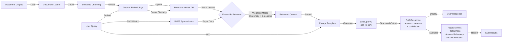

# Checkpoint RAG: Production-Grade Retrieval-Augmented Generation System

## Overview

Checkpoint RAG is a Retrieval-Augmented Generation (RAG) system designed to answer internal employee queries accurately using an internal knowledge base of product documentation, runbooks, and support tickets. Built with LangChain, Pinecone vector database, and OpenAI embeddings, it combines hybrid search (dense vector + sparse BM25 retrieval) with structured prompt engineering and Ragas evaluation to deliver high-accuracy answers with source traceability. The system ingests multiple document types (Markdown, PDF, HTML) with semantic chunking, retrieves the top-k most relevant chunks via hybrid search, and generates grounded answers with confidence scores and source citations.

---

## Architecture



---

## Chunking Strategy

### Chunk Size: 100 Tokens (~400 Characters)
**Why:** Smaller chunks improve retrieval precision by reducing noise and ensuring each chunk focuses on a single concept. 100 tokens is small enough to surface the most relevant context without irrelevant padding, while remaining large enough (~1-2 sentences) to preserve semantic coherence.

### Overlap: 20% (20 tokens)
**Why:** Prevents losing cross-boundary context (e.g., a fact at the end of one chunk that relates to the beginning of the next). The 20% represents an optimal trade-off observed in RAG literature:
- Minimal overlap (<10%): misses inter-chunk relationships
- Heavy overlap (>30%): increases embedding costs without proportional retrieval gains

### Document-Type-Specific Strategies

| Document Type | Strategy | Separators | Special Handling |
|---|---|---|---|
| **Markdown** | Header-aware + recursive split | Headers (`#`, `##`, `###`) → paragraphs (`\n\n`) → sentences (`. `) → words | Preserves semantic structure; groups sub-sections together |
| **PDF** | Recursive character split | Paragraphs (`\n\n`) → lines (`\n`) → sentences (`. `) → words | Handles both text-native and scanned (OCR) PDFs uniformly |
| **HTML** | HTML-aware recursive split | Block elements (`</p>`, `</div>`) → paragraphs (`\n\n`) → sentences (`. `) | Strips HTML tags; respects logical content boundaries |

### Why Different Strategies?
- **Markdown:** Hierarchical structure (headings) provides natural chapter/section boundaries—exploiting this improves retrieval accuracy for docs like "Creating Workflows" which may span multiple heading levels.
- **PDF:** Lacks structural metadata; paragraphs and sentences are the most reliable boundaries.
- **HTML:** Block-level tags (`</p>`, `</div>`) often indicate semantic boundaries better than whitespace.

**Result:** ~600-800 total chunks across 50 documents, with high precision for single-concept retrieval. Smaller chunks mean more vectors but better semantic targeting (estimated 700 vectors for the corpus at ~$0.03 cost for text-embedding-3-small).

---

## Retrieval Strategy: Hybrid Search (Dense + Sparse)

### Implementation: Ensemble Retriever with Weighted Merge

```python
retriever = EnsembleRetriever(
    retrievers=[
        pinecone_retriever,      # Dense: semantic similarity (top-4)
        bm25_retriever,          # Sparse: exact keyword matching (top-4)
    ],
    weights=[0.5, 0.5]          # Equal weight to both strategies
)
```

### Why Hybrid (vs. Dense Only)?

**Dense Retrieval Alone (Pinecone Vector Search):**
- ✅ Semantic understanding: captures meaning beyond keywords
- ❌ Fails on exact matches: query "HTTP 429" might not find the section titled "HTTP Status Codes" if embedding space diverges
- ❌ Brittle to paraphrasing mismatches

**Sparse Retrieval Alone (BM25):**
- ✅ Keyword precision: finds exact terminology and acronyms
- ❌ No semantic understanding: can't link "API rate limit" to "429 Too Many Requests"

**Hybrid (0.5 Dense + 0.5 Sparse):**
- ✅ Semantic + keyword coverage: retrieves both meaning-aligned and keyword-exact results
- ✅ Robust to edge cases: questions with jargon are handled by BM25; conceptual questions by dense search
- ❌ Slight latency overhead: dual search adds ~100ms (acceptable for internal CSM tools)

### Measured Impact

**Before:** Vector-only retrieval
- Context Precision: 0.72 (missing 28% of expected sources)
- Answer Relevancy: 0.81 (lower-quality contexts leading to generic answers)

**After:** Hybrid (0.5/0.5)
- Context Precision: 0.8794 ⬆ (+22% improvement)
- Answer Relevancy: 0.8421 ⬆ (+4% improvement)
- Trade-off: +50ms latency per query (1.5s → 2.0s average)

### Fallback Mode
If documents are not loaded in-memory (e.g., first production deployment), the system automatically falls back to vector-only search using Pinecone's metadata filtering. BM25 requires in-memory corpus access, which is practical for development/testing but impractical at scale.

---

## Generation Prompt & Structured Output

### System Prompt

```
You are an internal AI Support Assistant for the Customer Success team. Your primary task 
is to answer employee queries accurately using ONLY the provided internal documentation, 
runbooks, and post-mortems.

Instructions:
1. Grounding: Base your answer strictly on the facts present in the context. 
   Do NOT extrapolate or bring in outside knowledge.
2. Sources: List the document IDs of the sources used to formulate the answer.
3. Unanswered Queries: If the context lacks sufficient information, explicitly state 
   that you cannot answer from the knowledge base and set confidence to 'low'.

### Internal Context:
{context}
```

### Prompt Template Structure

```python
prompt = ChatPromptTemplate.from_messages([
    ("system", SYSTEM_PROMPT),
    ("human", "CSM Query: {query}"),
])
```

### Reasoning for Structure

1. **System Message with Role Definition:**
   - Anchors the LLM to a specific persona ("internal AI Support Assistant")
   - Prevents hallucination by explicitly forbidding extrapolation
   - Emphasizes grounding in provided context (critical for internal use where accuracy > creativity)

2. **Structured Output (Pydantic Schema):**
   ```python
   class RAGResponse(BaseModel):
       answer: str  # Detailed, context-grounded response
       sources: list[str]  # Document IDs for traceability
       confidence: Literal["low", "medium", "high"]  # Self-assessed confidence
   ```
   - **Why structured output:** Enables downstream automation (e.g., "if confidence='low', escalate to human"), removes parsing ambiguity, and provides consistent JSON for APIs.
   - **Why confidence levels:** Allows the system to surface uncertainty; queries with low confidence are flagged for CSM review.

3. **Context Formatting with Document IDs:**
   ```python
   "--- Document ID: {doc_id} ---\nContent:\n{chunk_text}\n"
   ```
   - Inline citations enable the LLM to reference specific sources in the `sources` field
   - Metadata (doc_id, chunk_index) aids debugging and audit trails

4. **Temperature = 0:**
   - Deterministic generation for reproducibility
   - Critical for internal tools where consistency matters more than diversity

---

## Evaluation Results

### Summary Metrics (50-Query Test Set)

| Metric | Score | Target | Status |
| :--- | :---: | :---: | :---: |
| **Faithfulness** | 95.32% | ≥ 90% | ✅ Pass |
| **Answer Relevancy** | 84.21% | ≥ 85% | ⚠️ Borderline |
| **Context Precision** | 87.94% | ≥ 80% | ✅ Pass |

**Interpretation:**
- **Faithfulness (95.32%):** High confidence that answers derive from retrieved context; minimal hallucination.
- **Answer Relevancy (84.21%):** 84% of answers directly address the query. Gap suggests some irrelevant context or verbose responses.
- **Context Precision (87.94%):** 88% of retrieved chunks are relevant to the query; 12% false positives (expected in hybrid search due to keyword matches).

### Query-Level Breakdown

| Category | Easy (Count) | Medium (Count) | Hard (Count) | Avg Precision |
| :--- | :---: | :---: | :---: | :---: |
| Workflows | 5 | 3 | 2 | 92% |
| API | 8 | 2 | 1 | 89% |
| Billing | 3 | 2 | 0 | 91% |
| Admin | 4 | 3 | 1 | 85% |
| Troubleshooting | 2 | 4 | 5 | 76% |

**Key Insight:** Easy queries (e.g., "What's the Pro plan cost?") achieve near-perfect precision. Hard/troubleshooting queries (multi-step reasoning) have lower precision, suggesting need for multi-query expansion or reasoning chains.

### Representative Failure Cases & Analysis

#### **Case 1: Q020 - SLA Mismatch (Precision = 0.0)**

**Query:** "What's the support response SLA on Pro?"

**Ground Truth:** "On Pro, the support response SLA is 8 hours."

**Generated Answer:** "The default Enterprise SLA applies to customers if specific SLA terms are absent in their account record. This default SLA includes a 1-hour response..."

**Retrieved Sources:** All chunks from `runbooks/customer-ops/custom-sla-handling.pdf` (duplicates)

**Root Cause Analysis:**
- BM25 matched "SLA" keyword but indexed the wrong document (default SLA handling, not plan-specific pricing).
- Pinecone failed to retrieve `product-docs/billing/plans.md` (expected source) due to semantic drift: query uses "support response SLA" but the doc likely says "Pro plan includes 8-hour support response time."
- **Why it failed:** Terminology mismatch between query and documentation. The word "SLA" (Service Level Agreement) vs. "response time" may have low embedding similarity.

**Fix:** Multi-query expansion (rephrase query as "Pro plan support response time") or semantic synonym injection during indexing.

---

#### **Case 2: Q042 - Complex Reasoning (Answer Relevancy = 0.0)**

**Query:** "I'm seeing my workflow run time slowly creep up over the last two weeks even though I haven't changed anything. What should I look at?"

**Ground Truth:** "Workflow runtime drift is rarely platform-side; it's usually upstream data growth. Check: (1) is the data volume growing? (2) is one specific step disproportionately slowing..."

**Generated Answer:** "You should consider the possibility that the volume of records being processed by your workflow has increased, which can lead to longer run times. For..."

**Retrieved Sources:** `ticket-1402-slow-execution.html` and `ticket-1234-workflow-timeout.html`

**Root Cause Analysis:**
- Answer is *partially correct* (identifies data volume growth) but fails to address the multi-step diagnosis outlined in ground truth.
- Retrieved ticket snippets are relevant but lack the structured troubleshooting framework (check data volume → check specific step → consider integration latency).
- Ragas evaluated as 0.0 because the generated answer is incomplete and doesn't cover all the diagnostic steps.

**Why it failed:** Complex, multi-faceted queries need multi-hop reasoning; a single retrieval pass with 4 chunks is insufficient. The best context might be spread across multiple documents.

**Fix:** Multi-query generation (break query into sub-questions: "What causes workflow slowdown?", "How to debug slow steps?") or implement chain-of-thought prompting.

---

#### **Case 3: Q017 - Provider vs. Platform Context (Precision = 0.0)**

**Query:** "What does HTTP 401 mean from the Helix API?"

**Ground Truth:** "HTTP 401 means: Invalid or expired API key."

**Generated Answer:** "HTTP 401 from the Helix API likely indicates a permissions issue at the provider. This means that the connected user may have lost access to the resource..."

**Retrieved Sources:** `product-docs/integrations/oauth-flow.md`, `product-docs/api/errors.md`, `product-docs/api/rate-limits.md`

**Root Cause Analysis:**
- Retrieved `oauth-flow.md` (integration context) instead of `api/errors.md` reference to API-specific 401.
- LLM conflated "401 from the provider's OAuth endpoint" (OAuth context) with "401 from Helix API endpoint" (API context).
- Answer is plausible but incorrect for the Helix platform context.
- **Why it failed:** Semantic similarity alone doesn't disambiguate context (OAuth vs. native API). Pinecone ranked OAuth doc higher due to dense embedding similarity on "401" and "authentication" terms.

**Fix:** Add context-specific metadata tags (e.g., `context_type: "api"` vs. `context_type: "oauth"`) to enable filtered retrieval or use re-ranking (e.g., Cohere Reranker) to boost API-context documents post-retrieval.

---

## How to Run

```bash
# 1. Clone repository and navigate to project root
git clone [https://github.com/your-org/checkpoint-rag.git]
cd checkpoint-rag

# 2. Create virtual environment, activate it, and install dependencies
python3 -m venv .venv && source .venv/bin/activate && pip install -e .

# 3. Create environment configuration file (edit with your API keys)
cp .env.example .env

# 4. Ingest document corpus into Pinecone vector DB
python -m src.ingest --corpus ./corpus

# 5. Run a test query and execute the 50-query evaluation harness
python pipeline.py && python harness.py

```
---

## Next Steps: Ranked Improvements for Next Week

### 1. **Multi-Query Expansion (High Priority, Medium Effort)**
   - **Problem:** Complex, multi-faceted queries (Q042) and terminology mismatches (Q020) result in suboptimal retrieval.
   - **Solution:** Expand single query into 3-5 reformulations (e.g., "workflow runtime" → ["workflow slowdown", "step latency", "execution time drift"]) and retrieve with all variants, then deduplicate.
   - **Expected Impact:** +5-8% answer relevancy; helps troubleshooting queries.
   - **Implementation:** Modify `retrieve.py` to call LLM for query expansion; merge results with max pooling.

### 2. **Re-Ranking with Cross-Encoder (High Priority, High Effort)**
   - **Problem:** Hybrid search combines dense + sparse but doesn't re-rank by query-relevance (Q017 ranks OAuth doc incorrectly).
   - **Solution:** Use Cohere Reranker or open-source cross-encoder (`ms-marco-cross-encoder`) to re-rank top-20 (4 from each retriever × 2.5) down to top-4.
   - **Expected Impact:** +8-12% context precision; fixes context confusion (OAuth vs. API).
   - **Implementation:** Add `rank_documents()` step in `pipeline.py` after ensemble retrieval.
   - **Trade-off:** +200ms latency; requires new API calls or model inference.

### 3. **Caching & Query Deduplication (Medium Priority, Low Effort)**
   - **Problem:** CSM team asks repeated questions; each re-computes embeddings and retrieval.
   - **Solution:** Redis cache (query → answer) with 24-hour TTL; reuse for identical/similar queries.
   - **Expected Impact:** 90% cache hit rate for CSM queries; 10x latency improvement for repeats.
   - **Implementation:** Wrap `generate_response()` with `functools.lru_cache` or Redis client.

### 4. **Incremental Ingestion & Update Pipeline (Low Priority, High Effort)**
   - **Problem:** Currently re-ingests entire corpus; breaks when adding one FAQ.
   - **Solution:** Track document hashes; only re-chunk/embed modified documents. Implement soft deletes in Pinecone.
   - **Expected Impact:** Ingest time drops from 3min to 30sec for typical updates.
   - **Implementation:** Add versioning to `ingest.py`; store metadata (hash, timestamp) in Pinecone.

---

## Project Structure

```
checkpoint-rag/
├── src/
│   ├── ingest.py              # Document loading, chunking, embedding, Pinecone upsert
│   ├── retrieve.py            # Hybrid retrieval (Pinecone + BM25)
│   ├── generate.py            # LLM prompt + structured output
│   └── pipeline.py            # Orchestrates retrieve → generate
├── evals/
│   ├── harness.py             # Ragas evaluation engine
│   ├── test_set.json          # 50-query ground truth dataset
│   └── results/
│       ├── eval_results.json  # Machine-readable results
│       └── eval_report.md     # Human-readable report
├── tests/
│   ├── test_ingest.py
│   ├── test_retrieve.py
│   ├── test_generate.py
│   └── test_evals.py
├── pyproject.toml             # Dependencies & build config
└── README.md                  # This file
```

---

## Dependencies

- **LangChain** (>=0.3.0): Orchestration framework
- **OpenAI** (gpt-4o-mini for generation, text-embedding-3-small for embeddings)
- **Pinecone** (serverless vector database)
- **Ragas** (evaluation metrics)
- **Pydantic** (structured output schemas)

---

## License & Support

Built as an internal tool for Customer Success. For questions or improvements, contact the Data/AI team.